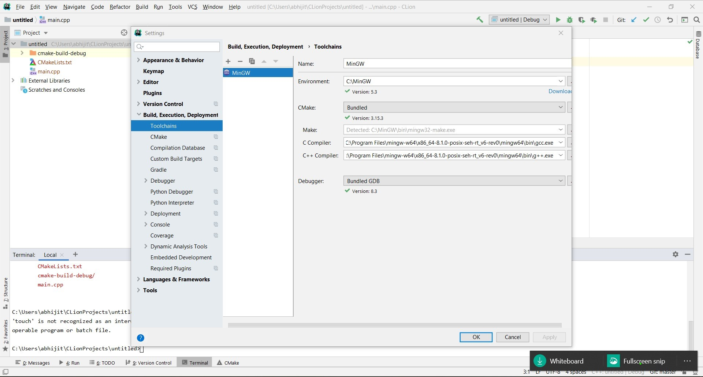

# My_Learning-Cpp
Learn C++ programming from past experienced programmers Java, Python, C.

## Installation
### How I use?
* Editor (with suggestion): Sublime Text 3 (Crack version with setup), [suggestion](#sublime-text-3-recommended-editor)
* Compiler
	- Testing: Use GNU compiler
		- gcc (via `bash` terminal) [for linux (Ubuntu)] 
		- gcc (via Windows inside ST3) <kbd>ctrl + b</kbd> to build.

	> NOTE: when you are not doing inside ST3, you don't have the facility of giving input via `scanf`/`cin`.
	
	- Production/Project: Use CMake (in linux (Ubuntu))

### Tools
> NOTES: Some important notes to be kept in mind before initiating Installation process: <br/>

> - For C++, I like Windows GUI & Linux. So, best of both world is Editor (in Windows Environment) & use the compiler (in Linux (Ubuntu)). 

>	- So, 2 methods: <br/>
		+ M-1: ST3 (code suggestion from EasyClangComplete package) + CMake (in Ubuntu) [RECOMMENDED] <br/>
		+ M-2: CLion. This is going to be heavy IDE, so it will take a lot of RAM space (3 GB approx.)

>	- Along with std. libraries include this [boost](https://www.boost.org/users/history/version_1_67_0.html) package in the directory of installed mingw-64 (gcc for windows) - "mingw-w64\i686-8.1.0-posix-dwarf-rt_v6-rev0\mingw32\lib\gcc\i686-w64-mingw32\8.1.0\include\c++" 
	
> - __gcc vs g++ differences__ <br/>
		+ define
	```
	  gcc: GNU C Compiler
	  g++: GNU C++ Compiler
	```
		+ gcc will compile: *.c/*.cpp files as C and C++ respectively.
		+ g++ will compile: *.c/*.cpp files but they will all be treated as C++ files.
		+ Also if you use g++ to link the object files it automatically links in the std C++ libraries (gcc does not do this).
		+ gcc compiling C files has fewer predefined macros.
		+ gcc compiling *.cpp and g++ compiling *.c/*.cpp files has a few extra macros.

> Note: For c++ you should use g++.


* Online IDE - https://www.onlinegdb.com/online_c++_compiler
* Platforms:
	- Linux: GCC (`sudo apt install gcc` or `sudo apt install gcc-8` or `sudo apt install g++-8` >> prioritize b/w gcc versions like this: `$ sudo update-alternatives --install /usr/bin/gcc gcc /usr/bin/gcc-8 800 --slave /usr/bin/g++ g++ /usr/bin/g++-8`), [CMake](https://cmake.org/download/)
		+ folders used by gcc for C:
```console
$ gcc -xc -E -v -
Using built-in specs.
COLLECT_GCC=gcc
OFFLOAD_TARGET_NAMES=nvptx-none
OFFLOAD_TARGET_DEFAULT=1
Target: x86_64-linux-gnu
Configured with: ../src/configure -v --with-pkgversion='Ubuntu 8.4.0-1ubuntu1~18.04' --with-bugurl=file:///usr/share/doc/gcc-8/README.Bugs --enable-languages=c,ada,c++,go,brig,d,fortran,objc,obj-c++ --prefix=/usr --with-gcc-major-version-only --program-suffix=-8 --program-prefix=x86_64-linux-gnu- --enable-shared --enable-linker-build-id --libexecdir=/usr/lib --without-included-gettext --enable-threads=posix --libdir=/usr/lib --enable-nls --enable-clocale=gnu --enable-libstdcxx-debug --enable-libstdcxx-time=yes --with-default-libstdcxx-abi=new --enable-gnu-unique-object --disable-vtable-verify --enable-libmpx --enable-plugin --enable-default-pie --with-system-zlib --with-target-system-zlib=auto --enable-objc-gc=auto --enable-multiarch --disable-werror --with-arch-32=i686 --with-abi=m64 --with-multilib-list=m32,m64,mx32 --enable-multilib --with-tune=generic --enable-offload-targets=nvptx-none --without-cuda-driver --enable-checking=release --build=x86_64-linux-gnu --host=x86_64-linux-gnu --target=x86_64-linux-gnu
Thread model: posix
gcc version 8.4.0 (Ubuntu 8.4.0-1ubuntu1~18.04)
COLLECT_GCC_OPTIONS='-E' '-v' '-mtune=generic' '-march=x86-64'
 /usr/lib/gcc/x86_64-linux-gnu/8/cc1 -E -quiet -v -imultiarch x86_64-linux-gnu - -mtune=generic -march=x86-64 -fstack-protector-strong -Wformat -Wformat-security
ignoring nonexistent directory "/usr/local/include/x86_64-linux-gnu"
ignoring nonexistent directory "/usr/lib/gcc/x86_64-linux-gnu/8/../../../../x86_64-linux-gnu/include"
#include "..." search starts here:
#include <...> search starts here:
 /usr/lib/gcc/x86_64-linux-gnu/8/include
 /usr/local/include
 /usr/lib/gcc/x86_64-linux-gnu/8/include-fixed
 /usr/include/x86_64-linux-gnu
 /usr/include
End of search list.
# 1 "<stdin>"
# 1 "<built-in>"
# 1 "<command-line>"
# 31 "<command-line>"
# 1 "/usr/include/stdc-predef.h" 1 3 4
# 32 "<command-line>" 2
# 1 "<stdin>"
COMPILER_PATH=/usr/lib/gcc/x86_64-linux-gnu/8/:/usr/lib/gcc/x86_64-linux-gnu/8/:/usr/lib/gcc/x86_64-linux-gnu/:/usr/lib/gcc/x86_64-linux-gnu/8/:/usr/lib/gcc/x86_64-linux-gnu/
LIBRARY_PATH=/usr/lib/gcc/x86_64-linux-gnu/8/:/usr/lib/gcc/x86_64-linux-gnu/8/../../../x86_64-linux-gnu/:/usr/lib/gcc/x86_64-linux-gnu/8/../../../../lib/:/lib/x86_64-linux-gnu/:/lib/../lib/:/usr/lib/x86_64-linux-gnu/:/usr/lib/../lib/:/usr/lib/gcc/x86_64-linux-gnu/8/../../../:/lib/:/usr/lib/
COLLECT_GCC_OPTIONS='-E' '-v' '-mtune=generic' '-march=x86-64'
```
		+ folders used by gcc for C++:
```console
$ gcc -xc++ -E -v -
Using built-in specs.
COLLECT_GCC=gcc
OFFLOAD_TARGET_NAMES=nvptx-none
OFFLOAD_TARGET_DEFAULT=1
Target: x86_64-linux-gnu
Configured with: ../src/configure -v --with-pkgversion='Ubuntu 8.4.0-1ubuntu1~18.04' --with-bugurl=file:///usr/share/doc/gcc-8/README.Bugs --enable-languages=c,ada,c++,go,brig,d,fortran,objc,obj-c++ --prefix=/usr --with-gcc-major-version-only --program-suffix=-8 --program-prefix=x86_64-linux-gnu- --enable-shared --enable-linker-build-id --libexecdir=/usr/lib --without-included-gettext --enable-threads=posix --libdir=/usr/lib --enable-nls --enable-clocale=gnu --enable-libstdcxx-debug --enable-libstdcxx-time=yes --with-default-libstdcxx-abi=new --enable-gnu-unique-object --disable-vtable-verify --enable-libmpx --enable-plugin --enable-default-pie --with-system-zlib --with-target-system-zlib=auto --enable-objc-gc=auto --enable-multiarch --disable-werror --with-arch-32=i686 --with-abi=m64 --with-multilib-list=m32,m64,mx32 --enable-multilib --with-tune=generic --enable-offload-targets=nvptx-none --without-cuda-driver --enable-checking=release --build=x86_64-linux-gnu --host=x86_64-linux-gnu --target=x86_64-linux-gnu
Thread model: posix
gcc version 8.4.0 (Ubuntu 8.4.0-1ubuntu1~18.04)
COLLECT_GCC_OPTIONS='-E' '-v' '-mtune=generic' '-march=x86-64'
 /usr/lib/gcc/x86_64-linux-gnu/8/cc1plus -E -quiet -v -imultiarch x86_64-linux-gnu -D_GNU_SOURCE - -mtune=generic -march=x86-64 -fstack-protector-strong -Wformat -Wformat-security
ignoring duplicate directory "/usr/include/x86_64-linux-gnu/c++/8"
ignoring nonexistent directory "/usr/local/include/x86_64-linux-gnu"
ignoring nonexistent directory "/usr/lib/gcc/x86_64-linux-gnu/8/../../../../x86_64-linux-gnu/include"
#include "..." search starts here:
#include <...> search starts here:
 .
 /usr/include/python3.6m/
 /usr/include/c++/8
 /usr/include/x86_64-linux-gnu/c++/8
 /usr/include/c++/8/backward
 /usr/lib/gcc/x86_64-linux-gnu/8/include
 /usr/local/include
 /usr/lib/gcc/x86_64-linux-gnu/8/include-fixed
 /usr/include/x86_64-linux-gnu
 /usr/include
End of search list.
# 1 "<stdin>"
# 1 "<built-in>"
# 1 "<command-line>"
# 1 "/usr/include/stdc-predef.h" 1 3 4
# 1 "<command-line>" 2
# 1 "<stdin>"
COMPILER_PATH=/usr/lib/gcc/x86_64-linux-gnu/8/:/usr/lib/gcc/x86_64-linux-gnu/8/:/usr/lib/gcc/x86_64-linux-gnu/:/usr/lib/gcc/x86_64-linux-gnu/8/:/usr/lib/gcc/x86_64-linux-gnu/
LIBRARY_PATH=/usr/lib/gcc/x86_64-linux-gnu/8/:/usr/lib/gcc/x86_64-linux-gnu/8/../../../x86_64-linux-gnu/:/usr/lib/gcc/x86_64-linux-gnu/8/../../../../lib/:/lib/x86_64-linux-gnu/:/lib/../lib/:/usr/lib/x86_64-linux-gnu/:/usr/lib/../lib/:/usr/lib/gcc/x86_64-linux-gnu/8/../../../:/lib/:/usr/lib/
COLLECT_GCC_OPTIONS='-E' '-v' '-mtune=generic' '-march=x86-64'
```
	- Windows: [MinGW (Minimalist GNU for Windows)](https://sourceforge.net/projects/mingw-w64/files/Toolchains%20targetting%20Win32/Personal%20Builds/mingw-builds/installer/mingw-w64-install.exe/download), [CMake](https://cmake.org/download/)
* MinGW-64 (GNU, GCC for Windows)
	- Download from [here](https://sourceforge.net/projects/mingw-w64/files/Toolchains%20targetting%20Win32/Personal%20Builds/mingw-builds/installer/mingw-w64-install.exe/download)
	- Also, available in Clion folder (available locally with me)
	- set the params during installation in the dialog screen:
		+ Architecture: x86_64
		+ Threads: posix (for Multithreading)
		+ Exception: seh
	- Integrate with __Sublime Text 3__:
		+ For C++: Create a new build system. File - "gcc-cpp.sublime-build"
		```
		{
			"shell_cmd": "g++ -std=c++17 ${file_path}/${file_name} -o ${file_path}/${file_base_name} && ${file_path}/${file_base_name}.exe"
		}
		```
		+ For C: Create a new build system. File - "gcc-c.sublime-build"
		```
		{
			"shell_cmd": "gcc -std=c11 ${file_path}/${file_name} -o ${file_path}/${file_base_name} && ${file_path}/${file_base_name}.exe"
		}
		```
* Clion (for Windows)
	- version:`CLion 2019.3.5 x64`
	- Installation: present in my laptop
	- Configure (File >> Settings): see the image
		+ prerequisite installation: `mingw-64` (for latest gcc & g++ .exe files), `MinGW` (32-bit) (Watch this [video](https://www.youtube.com/watch?v=sXW2VLrQ3Bs))
		+ Image:

<p align="left">
  
</p>

* #### Sublime Text 3 ([RECOMMENDED] Editor)
	- For C++, ST3 is recommended for editing.
	- For compiling,
		+ NOTE:
			- For just simple testing a file, use `gcc` (for C) or `g++` (for C++).
			- For actual production, use `cmake`.
			- Here, Linting is done by fetching from a folder. E.g. mingw-64 (for C/C++): includes all required header files
		+ GNU Compiler Collection (GCC):
			- Windows: `mingw-64` __[Use it for standard & custom libs (like Boost, etc...)]__
			- Linux (Ubuntu): `sudo apt install build-essential` (includes: gcc, g++, make) [__[Use it for standard__]
		+ CMake: [RECOMMENDED for a C/C++ Project]
			- Windows: Download & Install from [here](https://cmake.org/download/)
			- Linux (Ubuntu): 
				- 1. Download for linux platform from [here](https://cmake.org/download/)
				- 2. `$ tar -zxvf <download-file-name-with-ext>` E.g.: `$ tar -zxvf cmake-3.15.2.tar.gz`
				- 3. `$ cd cmake-3.15.2`
				- 4. `$ ./bootstrap`
				- 5. `$ make`
				- 6. check if installed, `cmake --version`
	- To show where the function is defined:
		+ just add __mingw C++__ folder (from C:\ drive i.e. installed directory) into the "OPEN FILES" tab on the left of ST3.
		+ Then, on pointing the cursor on a function or subfunction => it shows the corresponding file where the function has been defined.
	- __Packages__
		+ [C++ Snippets](https://packagecontrol.io/packages/C%2B%2B%20Snippets): List of snippets [Documentation](https://github.com/Rapptz/cpp-sublime-snippet/blob/master/reference.md). This includes C++11 snippets.
		+ [SublimeLinter](https://packagecontrol.io/packages/SublimeLinter): For linting, install this via: "Preferences >> Package Settings >> SublimeLinter >> Settings". Just replace with this (below):
``` 
// SublimeLinter Settings - User
{
    "linters": {
        "gcc": {
            "disable": false,
            "executable": ["gcc"],
            "args": ["-fsyntax-only", "-std=c11"],
            "I": [
                // "${file_path}/include",
                // "${folder}/include",
                "/usr/local/include",
                "C:\\Program Files\\mingw-w64\\x86_64-8.1.0-posix-seh-rt_v6-rev0\\mingw64\\lib\\gcc\\x86_64-w64-mingw32\\8.1.0\\include\\c++",
                "F:\\Coding\\github_repos\\cpp_libs"],
            "excludes": [],
            "working_dir": "${file_path}",
        },
        "g++": {
            "disable": false,
            "executable": ["g++"],
            "args": ["-fsyntax-only", "-std=c++17"],
            "I": [
                // "${file_path}/include",
                // "${folder}/include",
                // "/usr/local/include",
                "C:\\Program Files\\mingw-w64\\x86_64-8.1.0-posix-seh-rt_v6-rev0\\mingw64\\lib\\gcc\\x86_64-w64-mingw32\\8.1.0\\include\\c++",
                "F:\\Coding\\github_repos\\cpp_libs"],
            "excludes": [],
            "working_dir": "${file_path}",
        },
    },
}
```
		+ [SublimeLinter-gcc](https://packagecontrol.io/packages/SublimeLinter-gcc): Install this after `SublimeLinter` package & then automatically, the linting starts. It fetches the header libraries from the mingw-64 or clang (whichever installed), provided in the settings page.
		+ [Append​Semi​Colon](https://packagecontrol.io/packages/AppendSemiColon): Install this to append `;` to the end of the code line using <kbd>ctrl + ;</kbd>. Also, to go to the new line & terminate the current line, use this: <kbd>ctrl + shift + ;</kbd> 
	- __Build system__
		+ One can use the default build system.
		+ But it is recommended to use a custom build system. "Tools >> Build System >> New Build System" --> <kbd>ctrl + s</kbd> to save the file
			- C: "gcc-c.sublime-build"
```
{
 	"shell_cmd": "gcc -std=c11 ${file_path}/${file_name} -o ${file_path}/${file_base_name} && ${file_path}/${file_base_name}.exe"
}			
```
			- C++:"gcc-cpp.sublime-build"
```
{
 	"shell_cmd": "g++ -std=c++17 ${file_path}/${file_name} -o ${file_path}/${file_base_name} && ${file_path}/${file_base_name}.exe"
}
```
	- __Snippet__
		+ `cout`
```
<snippet>
	<description>C/C++ - cout</description>
	<content><![CDATA[
std::cout << ${1:/*content*/} << "\n";
]]></content>
	<!-- Optional: Set a tabTrigger to define how to trigger the snippet -->
	<tabTrigger>coutendl</tabTrigger>
	<!-- Optional: Set a scope to limit where the snippet will trigger -->
	<scope>source.c++</scope>
</snippet>		
```
		+ `int main()`
```
<snippet>
	<description>C/C++ - int main</description>
	<content><![CDATA[
int main() {
	${1:/*content*/}

	return 0;
}
]]></content>
	<!-- Optional: Set a tabTrigger to define how to trigger the snippet -->
	<tabTrigger>int main</tabTrigger>
	<!-- Optional: Set a scope to limit where the snippet will trigger -->
	<scope>source.c++</scope>
</snippet>
```

* CMake - [Official](https://cmake.org/), [My notes](https://github.com/abhi3700/My_Learning-Cpp/blob/master/CMake.md)
* #### Using __Boost__ library or __custom library__ (via `mingw-64`)
	1. Download "Boost.zip" from [here](https://www.boost.org/users/history/version_1_72_0.html). Please ensure that the version is latest.
	2. [For Suggestion (in ST3 coding) & Compiling]
		- Suggestion for Editor: [Windows]--> Copy the "Boost" folder present inside, to the `"C:\Program Files\mingw-w64\x86_64-8.1.0-posix-seh-rt_v6-rev0\mingw64\lib\gcc\x86_64-w64-mingw32\8.1.0\include\c++"`directory. [Get started with Windows](https://www.boost.org/doc/libs/1_72_0/more/getting_started/windows.html)

	<p align="center">
	  
	</p>

		- Compiler: [Linux (Ubuntu)]-->
			+ M-1: after extracting the "Boost" folder from downloaded file (.zip) just move to the directory "/usr/local/include/"
				- Go to extracted boost folder (say `"C:\Program Files\mingw-w64\x86_64-8.1.0-posix-seh-rt_v6-rev0\mingw64\lib\gcc\x86_64-w64-mingw32\8.1.0\include\c++"`,
				- open `bash` here,
				- Move folder to "/usr/local/include/": `$ sudo cp -r ./x86_64-8.1.0-posix-seh-rt_v6-rev0/mingw64/lib/gcc/x86_64-w64-mingw32/8.1.0/include/c++/boost /usr/local/include`
				- DONE! Now, you can start using GNU compiler: gcc, g++
			+ [RECOMMENDED] M-2: Install as per the instruction [here](https://github.com/abhi3700/cpp-playground/tree/master/libs/boost-py#installation-for-linux-ubuntu)
				- Here also, doing the same thing as M-1, but boost-python also needs to be installed. Otherwise, boost-python installation would create a problem after following M-1 here in installing Boost.

	3. Now, write code in ST3 after the installation as per my [sublime text guidelines](#sublime-text-3-recommended-editor)

## Education (Learn)
* Udacity Course: C++ for Programmers - https://classroom.udacity.com/courses/ud210/
* Java from C++ -  https://www.seas.upenn.edu/~cis1xx/resources/JavaForCppProgrammers/j-javac-cpp-ltr.pdf
* Tutorials Java to C, C++ - http://cs.brown.edu/courses/cs123/docs/java_to_cpp.shtml
* Learn C++ from MSDN - https://msdn.microsoft.com/en-us/library/w5c4hyx3.aspx
* Google C++ guide - https://google.github.io/styleguide/cppguide.html
* Modern C++ guide - https://github.com/Microsoft/AirSim/blob/master/docs/coding_guidelines.md
* Cpp Core Guidelines - https://github.com/isocpp/CppCoreGuidelines
* learning & practising C++ from websites - 
  * https://www.studytonight.com/cpp/
  * http://www.learncpp.com/
  * https://www.includehelp.com/cpp-tutorial/
  * ftp://www.cs.uregina.ca/pub/class/cplusplus/CExample.html
* cpp nuts (concept, mcq, interview Q.) - [YouTube](https://www.youtube.com/user/MrRupeshyadav), [Website](http://cppnuts.com)
* Lectures | Modern C++ - CS 4984 Class Notes Fall 2019 - https://cpp.cs.cloud.vt.edu/
* C Programming Tutorial for Beginners (4 hour video) - https://www.youtube.com/watch?v=KJgsSFOSQv0
* C++ Programming Tutorial for Beginners (4 hour video) - https://www.youtube.com/watch?v=vLnPwxZdW4Y
* YouTube channels
	- [CodeBeauty](https://www.youtube.com/channel/UCl5-BV9aRaeDVohpE4sqJiQ)

## Repositories
### Programming
* C++ Practice - http://www.learncpp.com/ (All C++11 programs) **Imp. for EOS blockchain** (C++11, C++14, C++17)
* C++ Practice - https://github.com/dissonmatveev/exercises
* C++ - https://github.com/Sagar-022/c_plus_plus
* C++ programs by geeksforgeeks - https://www.geeksforgeeks.org/cc-programs/
* cpp-primer - https://github.com/Mooophy/Cpp-Primer
* Algorithms & Data structures in C++ - https://github.com/xtaci/algorithms#%E5%B7%B2%E5%AE%9E%E7%8E%B0--implemented-
* A C++ library for interacting with JSON - https://github.com/open-source-parsers/jsoncpp
* Practice C++ (tough ones) - https://github.com/bjut-hz/E-Books/blob/master/code%20exercise/leetcode-cpp.pdf
* free C++ class library of cryptographic schemes - https://github.com/weidai11/cryptopp
* 180+ Algorithm & Data Structure Problems using C++ - https://github.com/mandliya/algorithms_and_data_structures
* an efficient feature complete C++ bittorrent implementation - https://github.com/arvidn/libtorrent
* C++ JSON library for IoT. Simple and efficient - https://github.com/bblanchon/ArduinoJson
* All Algorithms implemented in C++ - https://github.com/TheAlgorithms/C-Plus-Plus
* A toolkit for making real world machine learning and data analysis applications in C++ - https://github.com/davisking/dlib
* toolkit for creative coding in C++ - https://github.com/openframeworks/openFrameworks
* Exercism exercises in C++ - https://github.com/exercism/cpp
* Exercism-Cpp by johnngugi - [Website](https://exercism.io/tracks/cpp/exercises), [Github](https://github.com/johnngugi/exercism-cpp)
* Cryptography with C++ - https://github.com/weidai11/cryptopp
* JSON for modern C++ - https://github.com/nlohmann/json
* Cpp files practice - https://github.com/samzhuwj/snippets/tree/master/cpp
* C++ header files package - https://github.com/samzhuwj/leet-code
* Awesome C++ - https://github.com/fffaraz/awesome-cpp
* Boost python Examples- https://github.com/TNG/boost-python-examples
* Speed Logger - https://github.com/gabime/spdlog
* cppbestpractices - https://github.com/lefticus/cppbestpractices
* The fastest JSON parser (2.2 GB/sec) - https://github.com/lemire/simdjson
* Algorithms in C++ - https://github.com/vsmolyakov/cpp
* Cpp Patterns - https://github.com/wj-zhu/cpp-patterns
* Cpp header files - https://github.com/wj-zhu/leet-code
* C++ Cheatsheet - https://github.com/mortennobel/cpp-cheatsheet
* C++ Algorithms - https://github.com/TheAlgorithms/C-Plus-Plus
* C Practice (200 days problems with Questions)- https://github.com/nkane/c-practice
* Boost C++ libraries (by Boris Schaling) - https://theboostcpplibraries.com/
* Cpp Threads - https://github.com/dzui42unit/Cpp-and-Threads
* multithreading - https://github.com/Sinh9x0-zz/multithreading
* C++ Code snippets - https://www.codegrepper.com/code-examples/cpp
* An implementation of C++17 std::filesystem for C++11 /C++14/C++17 on Windows, macOS, Linux and FreeBSD - https://github.com/gulrak/filesystem
* Parse command line arguments by defining a struct - https://github.com/p-ranav/structopt
* Windows Implementation Library (WIL) - https://github.com/microsoft/wil
* Conway's Game of Life in the Terminal - https://github.com/p-ranav/cgol
* Priority-based Task Scheduling for Modern C++ - https://github.com/p-ranav/psched
* UTF-8 with C++ in a Portable Way - https://github.com/nemtrif/utfcpp
* A C++ library for interacting with ANSI terminal windows - https://github.com/KazDragon/terminalpp
* "Small Vector" optimization for Modern C++: store up to a small number of items on the stack - https://github.com/p-ranav/small_vector
* Lightweight command-line tool for validating JSON - https://github.com/p-ranav/jsonlint
* Git for Modern C++ (A libgit2 Wrapper Library) - https://github.com/p-ranav/cppgit2
* Displayed width of UTF-8 strings in Modern C++ - https://github.com/p-ranav/unicode_display_width
* File/Directory Watcher for Modern C++ - https://github.com/p-ranav/fswatch
* STL algorithms with iterator - https://github.com/ryanhaining/cppitertools
* Magic Enum C++ - https://github.com/Neargye/magic_enum
* Glob for C++17 - https://github.com/p-ranav/glob
* C++17 variant for C++11/14/17 - https://github.com/mpark/variant
* Typesense (fast, typo-tolerant search engine for building delightful search experiences) - https://github.com/typesense/typesense
* Nameof operator for modern C++, simply obtain the name of a variable, type, function, macro, and enum - https://github.com/Neargye/nameof
* An async redis client designed for simplicity and reliability - https://github.com/mzimbres/aedis
* Cross-language bindings generator for C++, Java, Swift, and Dart - https://github.com/heremaps/gluecodium
* A curated list of awesome header-only C++ libraries - https://github.com/p-ranav/awesome-hpp
* Functional Programming Library for C++ - https://github.com/Dobiasd/FunctionalPlus, [Interface API search for functions](http://www.editgym.com/fplus-api-search/)
* Unit test frameworks
	- [UT: C++20 μ(micro)/Unit Testing Framework](https://github.com/boost-ext/ut) 
	- [A modern, C++-native, header-only, test framework for unit-tests](https://github.com/catchorg/Catch2)
* Nameof operator for modern C++ - https://github.com/Neargye/nameof
* library for metaprogramming - https://github.com/boostorg/hana

### Data Science
* CSV for Modern C++ - https://github.com/p-ranav/csv
* CSV2 for Modern C++ - https://github.com/p-ranav/csv2
* A modern C++ library for reading, writing, and analyzing CSV (and similar) files - https://github.com/vincentlaucsb/csv-parser [Recommended]
* Plot (plotly made for C++) - https://github.com/thclark/cpplot
* Dataframe (object created for C++) - https://github.com/hosseinmoein/DataFrame
* Numpy for C++ (NumCpp: A Templatized Header Only C++ Implementation of the Python NumPy Library) - https://github.com/dpilger26/NumCpp
* A light-weight high performance tensor algebra framework for modern C++ - https://github.com/romeric/Fastor
* C++ tensors with broadcasting and lazy computing - https://github.com/xtensor-stack/xtensor
* Advanced 2D Plotting for Dear ImGui - https://github.com/epezent/implot
* #### Charts
	- A modern C++ scientific plotting library powered by gnuplot - https://github.com/sciplot/sciplot
	- Easy Creation of GnuPlot Scripts from C++ - https://github.com/vincent-picaud/GnuPlotScripting
* #### Excel
	- libxlsxwriter (A C library for creating Excel XLSX files) - https://github.com/jmcnamara/libxlsxwriter
	- XLNT (a modern C++ library for manipulating spreadsheets) - https://github.com/tfussell/xlnt
	- QSimpleXlsxWriter (it makes unfeasible to edit data that were written) - https://github.com/QtExcel/QSimpleXlsxWriter
	- https://github.com/QtExcel/Qxlnt
* Nano range (Range-based goodness for C++17) - https://github.com/tcbrindle/NanoRange
* [Recommended] Matplot++: A C++ Graphics Library for Data Visualization - [Github](https://github.com/alandefreitas/matplotplusplus) , [Documentation](https://alandefreitas.github.io/matplotplusplus/)
* Extremely simple yet powerful header-only C++ plotting library built on the popular matplotlib - https://github.com/lava/matplotlib-cpp
* Data mining (Algebra, Scientific Computing) - https://github.com/tlk00/BitMagic

### Maths
* C++ template library for linear algebra: matrices, vectors, numerical solvers, and related algorithms 
	- [Gitlab](https://gitlab.com/libeigen/eigen/-/tree/master/Eigen), 
	- [Main page](http://eigen.tuxfamily.org/index.php?title=Main_Page), 
	- [Getting Started](http://eigen.tuxfamily.org/dox/GettingStarted.html)
* Blitz++ Multi-Dimensional Array Library for C++ - https://github.com/blitzpp/blitz
* Wide-Integer implements a generic C++ template for uint128_t, uint256_t, uint512_t, uint1024_t, etc - https://github.com/ckormanyos/wide-integer
* CppAD: A C++ Algorithmic Differentiation Package - https://github.com/coin-or/CppAD
* A Compositional Numeric Library for C++ - https://github.com/johnmcfarlane/cnl

### Machine Learning (ML)
* Scikit learn for C++ - https://github.com/VISWESWARAN1998/sklearn
* A fast, flexible machine learning library - https://github.com/mlpack/mlpack
* A light-weight high performance tensor algebra framework for modern C++ - https://github.com/romeric/Fastor

### Computer Vision
* OpenCV: Open Source Computer Vision Library - [Tutorials](https://www.opencv-srf.com/p/introduction.html), [Github](https://github.com/opencv/opencv)
* List of OpenCV projects to further increase the computer vision community. Coding in Python & C++(In progress) - https://github.com/rchavezj/OpenCV_Projects
* Learn OpenCV : C++ and Python Examples - https://github.com/spmallick/learnopencv
* Lane-Detection-for-Autonomous-Cars: Lane Detection Module using C++ and OpenCV - https://github.com/MichiMaestre/Lane-Detection-for-Autonomous-Cars
* Learning OpenCV 3 [Book] - https://github.com/oreillymedia/Learning-OpenCV-3_examples
* C++ video text recognition - https://github.com/bpieszko/CopyTextFromVideo
* Gesture Recognition Toolkit - https://github.com/nickgillian/grt

### GUI
* TablePainter is a simple class for qt-based applications that can print all kinds of tables - https://github.com/T0ny0/Qt-Table-Printer
* hexa, octal, decimal, binary converter - https://github.com/abrarShariar/NumConverter
* Filament is a real-time physically based rendering engine for Android, iOS, Windows, Linux, macOS and WASM/WebGL - https://github.com/google/filament

### Others
* libcluon (power microservices) - https://github.com/chrberger/libcluon
* inspectrum (Offline radio signal analyser) - https://github.com/miek/inspectrum
* fast_double_parser (parse strings into double (binary64) floating-point values) - https://github.com/lemire/fast_double_parser
* constexpr to string - https://github.com/tcsullivan/constexpr-to-string
* C++ client for making HTTP/REST requests - https://github.com/mrtazz/restclient-cpp
* Twitter REST and Stream APIs in C++ - https://github.com/a-n-t-h-o-n-y/Twitter-API-C-Library

## Books
* Design and Evolution of C++ by B. Stroustroup - https://github.com/bjut-hz/E-Books/blob/master/program%20language/The%20Design%20And%20Evolution%20Of%20Cpp.pdf
* Object Oriented Programming in C++ - [PDF](./Resources/Book_ObjectOrientedProgramminginC4thEdition.pdf)
* C++ Primer - http://www.charleshouserjr.com/Cplus2.pdf <br/>
       Solutions - https://github.com/pezy/CppPrimer
* C Notes for Professionals - Get the latest version from - https://books.goalkicker.com/CBook/
* C++ Notes for Professionals - Get the latest version from - https://books.goalkicker.com/CPlusPlusBook/
* C Programming: A Modern Approach - 
	- Book available here: ("./Resources")
	- Solutions: https://github.com/zoffixznet/c-practice
* Boost C++ Application Development Cookbook - [PDF](./Resources/Book_A_Polukhin_Boost_C++_Application_Development_Cookbook_2013.pdf), [online](http://apolukhin.github.io/Boost-Cookbook/), [codes, programs](https://github.com/apolukhin/Boost-Cookbook)
* Qt5 C++ GUI Programming - [PDF](./Resources/Qt5_Cpp_GUI_Programming.pdf)
* Beyond the C++ Standard Library: An Introduction to Boost - [PDF](./Resources/Beyond the C++ Standard Library An Introduction to Boost.pdf)
* A Complete Guide to Programming in C++ - [PDF](./Resources/A_Complete_Guide_to_programming_in_C++.pdf)
* SamsTeachYourself C++ in 1 hour a day - [PDF](./Resources/Sams Teach Yourself C++ in One Hour a Day, 7th Edition.pdf)
* Mastering C++ Multithreading - [PDF](./Resources/Mastering_C++_Multithreading.pdf), [Github codes](https://github.com/PacktPublishing/Mastering-CPP-Multithreading)
* C++ Multithreading Cookbook - [PDF](./Resources/Milos Ljumovic - C++ Multithreading Cookbook - 2014.pdf)
* Boost C++ Libraries - [Website](https://theboostcpplibraries.com/), [Solution](./Resources/Solutions_to_all_exercises_in_the_book_\'The_Boost_C++_Libraries\')


## Blogs
* Herb Sutter - https://herbsutter.com/
* Jonathan Boccara's blog - https://www.fluentcpp.com/
* Simplify C++ - https://arne-mertz.de/
* Bartek's coding blog - https://www.bfilipek.com/

## Videos
### Understanding
### Talks
* [ ] [CppCon 2017: Dietmar Kühl “The End of std::endl”](https://www.youtube.com/watch?v=6WeEMlmrfOI)
* [ ] [CppCon 2018: Jonathan Boccara “105 STL Algorithms in Less Than an Hour”](https://www.youtube.com/watch?v=2olsGf6JIkU)
* [ ] [Core C++ 2019 :: Bryce Adelstein :: Modules are Coming](https://youtu.be/bDTm6y6fNSU)
* [ ] [CppCon 2019: Timur Doumler “C++20: The small things”](https://youtu.be/Xb6u8BrfHjw)
* [ ] [Functional C++ - Kevlin Henney](https://youtu.be/mlkE8EJZODw)
* [ ] [Introduction to C++ Template Metaprogramming - Sasha Goldshtein](https://youtu.be/lrziylOWBT4)
* [ ] [Source Instrumentation for Monitoring C++ in Production - Steven Simpson](https://youtu.be/NPf88orMJT4)
* [ ] [Combining C++17 Features - Nicolai Josuttis](https://youtu.be/cOtb8Sb88TY)
* [ ] [C++: λ Demystified - Andreas Fertig](https://youtu.be/M0qy6RiMU90)
* [ ] [C++ Concepts for Developers - Hubert Matthews](https://youtu.be/ut40iShzqEY)
* [ ] [C++ Modules and Large-Scale Development (Part 1) - John Lakos](https://youtu.be/tn0l4EQHdZA)
* [ ] [C++ Modules and Large-Scale Development (Part 2) - John Lakos](https://youtu.be/bWkGmRkDyt4)
* [ ] [Freestanding C++ - Past, Present, and Future - Ben Saks](https://youtu.be/VoLHTmJ1Aas)
* [ ] [C++ in containers - Marc Goodner](https://youtu.be/jl6UkLrkkIw)
* [ ] [Storage Duration and Linkage in C and C++ - Dan Saks](https://youtu.be/0kgTuWkyorc)
* [ ] [C++ Smart Pointers - Usage and Secrets - Nicolai Josuttis](https://youtu.be/XH4xIyS9B2I)
* [ ] [Lambda? You Keep Using that Letter - Kevlin Henney](https://youtu.be/Y7StjYhXvpE)
* [ ] [Teaching C++ Workshop 2019 @MTA playlist](https://www.youtube.com/playlist?list=PLn4wYlDYx4bumJrfSjI8q_mXV0ieqJ6g7)
* [ ] [Core C++ 2019 - YouTube](https://www.youtube.com/playlist?list=PLn4wYlDYx4bszUM8uUJi55czMYuilXfaR)
* [ ] [Affine Combination: Divide by 0?](https://youtu.be/Hw3HkHzrhDg)
* [ ] [Functional-Style Programming](https://youtu.be/1slb7F9f8pY)
* [ ] [Rust for C++ Developers](https://youtu.be/QySVjA1PXBI)
* [ ] [The std::tuple](https://youtu.be/ecOqOlpjO_w)
* [ ] [Variations on Variant](https://youtu.be/SaVhzQBnWBo)
* [ ] [Core C++ 2019 :: Jason Turner :: The Best Parts of C++](https://youtu.be/SZ__h7uEDGc)
* [ ] [CppCon 2019: Jason Turner “The Best Parts of C++"](https://youtu.be/iz5Qx18H6lg)
* [ ] [C++17 - The Best Features - Nicolai Josuttis [ACCU 2018]](https://youtu.be/e2ZQyYr0Oi0)
* [x] [GOTO 2018 • C++ - the Newest Old Language • Matt Godbolt](https://youtu.be/HAFrggEDr5U)
* [ ] [C++ Code Smells - Jason Turner](https://youtu.be/nqfgOCU_Do4)
* [ ] [Alan Talbot “How to Choose the Right Standard Library Container, and Why You Should Want Some More”](https://youtu.be/yjPKVOYcw28)
* [ ] [CppCon 2019: Matt Godbolt “Path Tracing Three Ways: A Study of C++ Style”](https://youtu.be/HG6c4Kwbv4I)
* [ ] [C++Now 2017: Daniel Pfeifer “Effective CMake"](https://youtu.be/bsXLMQ6WgIk)
* [ ] [CppCon 2015: Herb Sutter "Writing Good C++14... By Default"](https://youtu.be/hEx5DNLWGgA)
* [ ] [C++Now 2018: Michael Caisse “Modern C++ in Embedded Systems”](https://youtu.be/c9Xt6Me3mJ4)

## FAQs
* By ISOCPP - https://isocpp.org/wiki/faq
* From C++ FAQ book - http://www.parashift.com:80/c++-faq-lite/
* http://yosefk.com/c++fqa/index.html
* C Faq - http://c-faq.com/index.html

## Articles
* [How to Improve Your C++ Skills From Awesome Projects](https://hackernoon.com/how-to-improve-your-c-skills-from-awesome-projects-251b300ed5a1)
* [CSV file management in C++](https://www.geeksforgeeks.org/csv-file-management-using-c/)
* [Emulating Boost.MultiIndex with Standard Containers]
(https://www.codesynthesis.com/~boris/blog/2012/09/11/emulating-boost-multi-index-with-std-containers/)

## IEEE
* A Project-Based Curriculum for Teaching C++ Object-Oriented Programming
