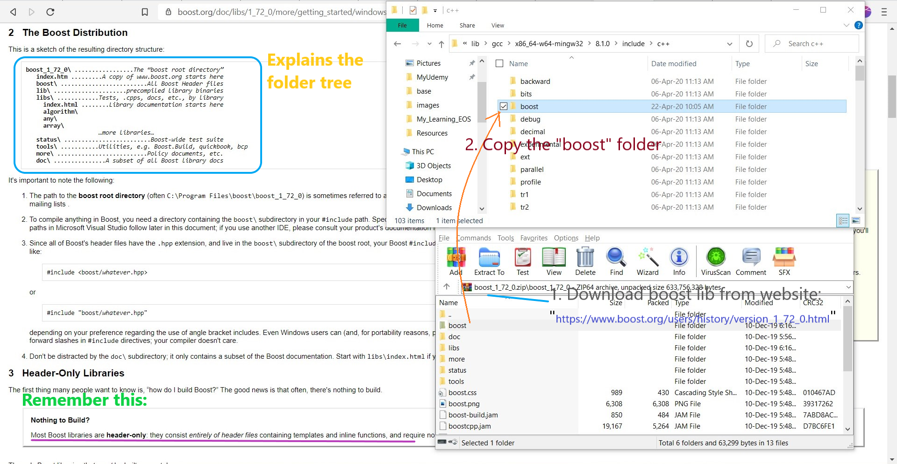

# My_Learning-Cpp
Learn C++ programming from past experienced programmers Java, Python, C.

## Installation
### How I use?
* Editor (with suggestion): Sublime Text 3 (Crack version with setup), [suggestion](#sublime-text-3-recommended-editor)
* Compiler
	- Testing: Use GNU compiler
		- mingw-64 [for Windows]
		- gcc [for linux (Ubuntu)]
	- Production/Project: Use CMake (in linux (Ubuntu))

### Salient points
> NOTES: Some important notes to be kept in mind before initiating Installation process: <br/>
	- For C++, I like Windows GUI & Linux. So, best of both world is Editor (in Windows Environment) & use the compiler (in Linux (Ubuntu)). <br/> 
	- So, 2 methods: <br/>
		+ M-1: ST3 (code suggestion from EasyClangComplete package) + CMake (in Ubuntu) [RECOMMENDED] <br/>
		+ M-2: CLion. This is going to be heavy IDE, so it will take a lot of RAM space (3 GB approx.) <br/>
	- Along with std. libraries include this [boost](https://www.boost.org/users/history/version_1_67_0.html) package in the directory of installed mingw-64 (gcc for windows) - "mingw-w64\i686-8.1.0-posix-dwarf-rt_v6-rev0\mingw32\lib\gcc\i686-w64-mingw32\8.1.0\include\c++" 

* Online IDE - https://www.onlinegdb.com/online_c++_compiler
* Platforms:
	- Linux: GCC (`sudo apt install gcc`), [CMake](https://cmake.org/download/)
	- Windows: [MinGW (Minimalist GNU for Windows)](https://sourceforge.net/projects/mingw-w64/files/Toolchains%20targetting%20Win32/Personal%20Builds/mingw-builds/installer/mingw-w64-install.exe/download), [CMake](https://cmake.org/download/)
* MinGW-64 (GNU, GCC for Windows)
	- Download from [here](https://sourceforge.net/projects/mingw-w64/files/Toolchains%20targetting%20Win32/Personal%20Builds/mingw-builds/installer/mingw-w64-install.exe/download)
	- Also, available in Clion folder (available locally with me)
	- set the params during installation in the dialog screen:
		+ Architecture: x86_64
		+ Threads: posix (for Multithreading)
		+ Exception: seh
	- Integrate with __Sublime Text 3__:
		+ For C++: Create a new build system. File - "gcc-cpp.sublime-build"
		```
		{
			"shell_cmd": "g++ -std=c++17 ${file_path}/${file_name} -o ${file_path}/${file_base_name} && ${file_path}/${file_base_name}.exe"
		}
		```
		+ For C: Create a new build system. File - "gcc-c.sublime-build"
		```
		{
			"shell_cmd": "gcc -std=c11 ${file_path}/${file_name} -o ${file_path}/${file_base_name} && ${file_path}/${file_base_name}.exe"
		}
		```
* Clion (for Windows)
	- version:`CLion 2019.3.5 x64`
	- Installation: present in my laptop
	- Configure (File >> Settings): see the image
		+ prerequisite installation: `mingw-64` (for latest gcc & g++ .exe files), `MinGW` (32-bit) (Watch this [video](https://www.youtube.com/watch?v=sXW2VLrQ3Bs))
		+ Image:

<p align="left">
  
</p>

* #### Sublime Text 3 ([RECOMMENDED] Editor)
	- For C++, ST3 is recommended for editing.
	- For compiling,
		+ NOTE:
			- For just simple testing a file, use `gcc` (for C) or `g++` (for C++).
			- For actual production, use `cmake`.
			- Here, Linting is done by fetching from a folder. E.g. mingw-64 (for C/C++): includes all required header files
		+ GNU Compiler Collection (GCC):
			- Windows: `mingw-64` __[Use it for standard & custom libs (like Boost, etc...)]__
			- Linux (Ubuntu): `sudo apt install build-essential` (includes: gcc, g++, make) [__[Use it for standard__]
		+ CMake: [RECOMMENDED for a C/C++ Project]
			- Windows: Download & Install from [here](https://cmake.org/download/)
			- Linux (Ubuntu): 
				- 1. Download for linux platform from [here](https://cmake.org/download/)
				- 2. `$ tar -zxvf <download-file-name-with-ext>` E.g.: `$ tar -zxvf cmake-3.15.2.tar.gz`
				- 3. `$ cd cmake-3.15.2`
				- 4. `$ ./bootstrap`
				- 5. `$ make`
				- 6. check if installed, `cmake --version`
	- To show where the function is defined:
		+ just add __mingw C++__ folder (from C:\ drive i.e. installed directory) into the "OPEN FILES" tab on the left of ST3.
		+ Then, on pointing the cursor on a function or subfunction => it shows the corresponding file where the function has been defined.
	- __Packages__
		+ [C++ Snippets](https://packagecontrol.io/packages/C%2B%2B%20Snippets): List of snippets [Documentation](https://github.com/Rapptz/cpp-sublime-snippet/blob/master/reference.md). This includes C++11 snippets.
		+ [SublimeLinter](https://packagecontrol.io/packages/SublimeLinter): For linting, install this via: "Preferences >> Package Settings >> SublimeLinter >> Settings". Just replace with this (below):
		``` 
		// SublimeLinter Settings - User
		{
		    "linters": {
		        "gcc": {
		            "disable": false,
		            "executable": ["gcc"],
		            "args": ["-fsyntax-only", "-std=c11"],
		            "I": [
		                // "${file_path}/include",
		                // "${folder}/include",
		                // "/usr/local/include",
		                "C:\\Program Files\\mingw-w64\\x86_64-8.1.0-posix-seh-rt_v6-rev0\\mingw64\\lib\\gcc\\x86_64-w64-mingw32\\8.1.0\\include\\c++"
		            ],
		            "excludes": [],
		        },
		        "g++": {
		            "disable": false,
		            "executable": ["g++"],
		            "args": ["-fsyntax-only", "-std=c++17"],
		            "I": [
		                // "${file_path}/include",
		                // "${folder}/include",
		                // "/usr/local/include",
		                "C:\\Program Files\\mingw-w64\\x86_64-8.1.0-posix-seh-rt_v6-rev0\\mingw64\\lib\\gcc\\x86_64-w64-mingw32\\8.1.0\\include\\c++"
		            ],
		            "excludes": [],
		        },
		    },
		}
		```
		+ [SublimeLinter-gcc](https://packagecontrol.io/packages/SublimeLinter-gcc): Install this after `SublimeLinter` package & then automatically, the linting starts. It fetches the header libraries from the mingw-64 or clang (whichever installed), provided in the settings page.
		+ [Append​Semi​Colon](https://packagecontrol.io/packages/AppendSemiColon): Install this to append `;` to the end of the code line using <kbd>ctrl + ;</kbd>. Also, to go to the new line & terminate the current line, use this: <kbd>ctrl + shift + ;</kbd> 
	- __Build system__
		+ One can use the default build system.
		+ But it is recommended to use a custom build system. "Tools >> Build System >> New Build System" --> <kbd>ctrl + s</kbd> to save the file
			- C: "gcc-c.sublime-build"
			```
			{
			 	"shell_cmd": "gcc -std=c11 ${file_path}/${file_name} -o ${file_path}/${file_base_name} && ${file_path}/${file_base_name}.exe"
			}			
			```
			- C++:"gcc-cpp.sublime-build"
			```
			{
			 	"shell_cmd": "g++ -std=c++17 ${file_path}/${file_name} -o ${file_path}/${file_base_name} && ${file_path}/${file_base_name}.exe"
			}
			```
	- __Snippet__
		+ `cout`
		```
		<snippet>
			<description>C/C++ - cout</description>
			<content><![CDATA[
		std::cout << ${1:/*content*/} << std::endl;
		]]></content>
			<!-- Optional: Set a tabTrigger to define how to trigger the snippet -->
			<tabTrigger>coutendl</tabTrigger>
			<!-- Optional: Set a scope to limit where the snippet will trigger -->
			<scope>source.c++</scope>
		</snippet>		
		```

* CMake - [Official](https://cmake.org/), [My notes](https://github.com/abhi3700/My_Learning-Cpp/blob/master/CMake.md)
* Using __Boost__ library or __custom library__ (via `mingw-64`)
	1. Download "Boost.zip" from [here](https://www.boost.org/users/history/version_1_72_0.html). Please ensure that the version is latest.
	2. [For Suggestion (in ST3 coding) & Compiling]
		- [Windows]: Copy the "Boost" folder present inside, to the `"C:\Program Files\mingw-w64\x86_64-8.1.0-posix-seh-rt_v6-rev0\mingw64\lib\gcc\x86_64-w64-mingw32\8.1.0\include\c++"`directory. [Get started with Windows](https://www.boost.org/doc/libs/1_72_0/more/getting_started/windows.html)

	<p align="center">
	  
	</p>

		- [Linux (Ubuntu)]: after extracting the "Boost" folder from downloaded file (.zip) just move to the directory "/usr/local/include/"
			+ Go to extracted boost folder (say `"C:\Program Files\mingw-w64\x86_64-8.1.0-posix-seh-rt_v6-rev0\mingw64\lib\gcc\x86_64-w64-mingw32\8.1.0\include\c++"`,
			+ open `bash` here,
			+ Move folder to "/usr/local/include/": `$ sudo cp -r ./x86_64-8.1.0-posix-seh-rt_v6-rev0/mingw64/lib/gcc/x86_64-w64-mingw32/8.1.0/include/c++/boost /usr/local/include`
			+ DONE! Now, you can start using GNU compiler: gcc, g++
	3. Now, write code in ST3 after the installation as per my [sublime text guidelines](#sublime-text-3-recommended-editor)

## Education (Learn)
* Udacity Course: C++ for Programmers - https://classroom.udacity.com/courses/ud210/
* Java from C++ -  https://www.seas.upenn.edu/~cis1xx/resources/JavaForCppProgrammers/j-javac-cpp-ltr.pdf
* Tutorials Java to C, C++ - http://cs.brown.edu/courses/cs123/docs/java_to_cpp.shtml
* Learn C++ from MSDN - https://msdn.microsoft.com/en-us/library/w5c4hyx3.aspx
* Google C++ guide - https://google.github.io/styleguide/cppguide.html
* Modern C++ guide - https://github.com/Microsoft/AirSim/blob/master/docs/coding_guidelines.md
* Cpp Core Guidelines - https://github.com/isocpp/CppCoreGuidelines
* learning & practising C++ from websites - 
  * https://www.studytonight.com/cpp/
  * http://www.learncpp.com/
  * https://www.includehelp.com/cpp-tutorial/
  * ftp://www.cs.uregina.ca/pub/class/cplusplus/CExample.html
* cpp nuts (concept, mcq, interview Q.) - [YouTube](https://www.youtube.com/user/MrRupeshyadav), [Website](http://cppnuts.com)
* Lectures | Modern C++ - CS 4984 Class Notes Fall 2019 - https://cpp.cs.cloud.vt.edu/
* C Programming Tutorial for Beginners (4 hour video) - https://www.youtube.com/watch?v=KJgsSFOSQv0
* C++ Programming Tutorial for Beginners (4 hour video) - https://www.youtube.com/watch?v=vLnPwxZdW4Y

## Repositories
* C++ Practice - http://www.learncpp.com/ (All C++11 programs) **Imp. for EOS blockchain** (C++11, C++14, C++17)
* C++ Practice - https://github.com/dissonmatveev/exercises
* C++ - https://github.com/Sagar-022/c_plus_plus
* C++ programs by geeksforgeeks - https://www.geeksforgeeks.org/cc-programs/
* cpp-primer - https://github.com/Mooophy/Cpp-Primer
* Algorithms & Data structures in C++ - https://github.com/xtaci/algorithms#%E5%B7%B2%E5%AE%9E%E7%8E%B0--implemented-
* A C++ library for interacting with JSON - https://github.com/open-source-parsers/jsoncpp
* a fast, flexible machine learning library - https://github.com/mlpack/mlpack
* Practice C++ (tough ones) - https://github.com/bjut-hz/E-Books/blob/master/code%20exercise/leetcode-cpp.pdf
* free C++ class library of cryptographic schemes - https://github.com/weidai11/cryptopp
* 180+ Algorithm & Data Structure Problems using C++ - https://github.com/mandliya/algorithms_and_data_structures
* an efficient feature complete C++ bittorrent implementation - https://github.com/arvidn/libtorrent
* C++ JSON library for IoT. Simple and efficient - https://github.com/bblanchon/ArduinoJson
* All Algorithms implemented in C++ - https://github.com/TheAlgorithms/C-Plus-Plus
* A toolkit for making real world machine learning and data analysis applications in C++ - https://github.com/davisking/dlib
* toolkit for creative coding in C++ - https://github.com/openframeworks/openFrameworks
* Exercism exercises in C++ - https://github.com/exercism/cpp
* Exercism-Cpp by johnngugi - [Website](https://exercism.io/tracks/cpp/exercises), [Github](https://github.com/johnngugi/exercism-cpp)
* Cryptography with C++ - https://github.com/weidai11/cryptopp
* JSON for modern C++ - https://github.com/nlohmann/json
* Cpp files practice - https://github.com/samzhuwj/snippets/tree/master/cpp
* C++ header files package - https://github.com/samzhuwj/leet-code
* Awesome C++ - https://github.com/fffaraz/awesome-cpp
* Boost python Examples- https://github.com/TNG/boost-python-examples
* C++ video text recognition - https://github.com/bpieszko/CopyTextFromVideo
* Speed Logger - https://github.com/gabime/spdlog
* cppbestpractices - https://github.com/lefticus/cppbestpractices
* The fastest JSON parser (2.2 GB/sec) - https://github.com/lemire/simdjson
* Algorithms in C++ - https://github.com/vsmolyakov/cpp
* Cpp Patterns - https://github.com/wj-zhu/cpp-patterns
* Cpp header files - https://github.com/wj-zhu/leet-code
* A C library for creating Excel XLSX files - https://github.com/jmcnamara/libxlsxwriter
* C++ Cheatsheet - https://github.com/mortennobel/cpp-cheatsheet
* C++ Algorithms - https://github.com/TheAlgorithms/C-Plus-Plus
* C Practice (200 days problems with Questions)- https://github.com/nkane/c-practice
* OpenCV: Open Source Computer Vision Library - [Tutorials](https://www.opencv-srf.com/p/introduction.html), [Github](https://github.com/opencv/opencv)
* Boost C++ libraries (by Boris Schaling) - https://theboostcpplibraries.com/

## Books
* Design and Evolution of C++ by B. Stroustroup - https://github.com/bjut-hz/E-Books/blob/master/program%20language/The%20Design%20And%20Evolution%20Of%20Cpp.pdf
* Object Oriented Programming in C++ - [PDF](./Resources/Book_ObjectOrientedProgramminginC4thEdition.pdf)
* C++ Primer - http://www.charleshouserjr.com/Cplus2.pdf <br/>
       Solutions - https://github.com/pezy/CppPrimer
* C++ Notes for Professionals - Get the latest version from - https://books.goalkicker.com/CPlusPlusBook/
* C++ Notes for Professionals - Get the latest version from - https://books.goalkicker.com/CBook/
* C Programming: A Modern Approach - 
	- Book available here: ("./Resources")
	- Solutions: https://github.com/zoffixznet/c-practice
* Boost C++ Application Development Cookbook - [PDF](./Resources/Book_A_Polukhin_Boost_C++_Application_Development_Cookbook_2013.pdf), [online](http://apolukhin.github.io/Boost-Cookbook/), [codes, programs](https://github.com/apolukhin/Boost-Cookbook)

## Data Science
* CSV for Modern C++ - https://github.com/p-ranav/csv
* A modern C++ library for reading, writing, and analyzing CSV (and similar) files - https://github.com/vincentlaucsb/csv-parser
* Plot (plotly made for C++) - https://github.com/thclark/cpplot
* Dataframe (object created for C++) - https://github.com/hosseinmoein/DataFrame
* Scikit learn for C++ - https://github.com/VISWESWARAN1998/sklearn
* Numpy for C++ (NumCpp: A Templatized Header Only C++ Implementation of the Python NumPy Library) - https://github.com/dpilger26/NumCpp

## Blogs
* Herb Sutter - https://herbsutter.com/
* Jonathan Boccara's blog - https://www.fluentcpp.com/

## Talks
* [CppCon 2017: Dietmar Kühl “The End of std::endl”](https://www.youtube.com/watch?v=6WeEMlmrfOI)
* [CppCon 2018: Jonathan Boccara “105 STL Algorithms in Less Than an Hour”](https://www.youtube.com/watch?v=2olsGf6JIkU)

## FAQs
* By ISOCPP - https://isocpp.org/wiki/faq
* From C++ FAQ book - http://web.archive.org/web/20150213025148/http://www.parashift.com:80/c++-faq-lite/
* http://yosefk.com/c++fqa/index.html
* C Faq - http://c-faq.com/index.html

## Articles
* [How to Improve Your C++ Skills From Awesome Projects](https://hackernoon.com/how-to-improve-your-c-skills-from-awesome-projects-251b300ed5a1)
* [CSV file management in C++](https://www.geeksforgeeks.org/csv-file-management-using-c/)
* [Emulating Boost.MultiIndex with Standard Containers]
(https://www.codesynthesis.com/~boris/blog/2012/09/11/emulating-boost-multi-index-with-std-containers/)

## IEEE
* A Project-Based Curriculum for Teaching C++ Object-Oriented Programming
